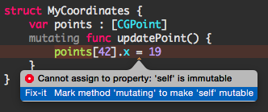

# What’s New in Swift 2.0

- [基础改进](#Fundamentals)
- [模式匹配](#Pattern Matching)    
- [可用性检查](#Availability Checking)
- [协议扩展](#Protocol Extensions)
- [错误处理](#Error Handling)

<a name="Fundamentals"></a>
## 基础改进

### 枚举

#### 打印输出增强

```swift
enum Animals {
    case Dog, Cat, Troll, Dragon
}
let a = Animals.Dragon
print(a) // 2.0 之前，打印 (Enum Value)；2.0 开始，打印 Dragon。
```

#### 泛型关联值改进

Swift 2.0 之前，下面这个泛型关联值的枚举会由于无法确定关联值所占内存大小而编译报错：

`error: unimplemented ir generation feature non-fixed multi-payload enum layout`

```swift
enum Either<T1, T2> {
    case First(T1)
    case Second(T2)
}
```

Swift 2.0 解决了上述问题。

#### 递归枚举支持

在 Swift 2.0 之前，像下面这样使用枚举类型本身作为关联值类型将无法通过编译：

```swift
enum Tree<T> {
    case Leaf(T)
    case Node(Tree, Tree)
}
```

Swift 2.0 开始支持递归枚举，只需标注`indirect`关键字即可：

```swift
enum Tree<T> {
    case Leaf(T)
    indirect case Node(Tree, Tree)
}
```

### do 语句

Swift 2.0 引入了一种`do`语句，可以使用该语句创建一个局部作用域，而在此之前只能使用闭包来实现此需求。

```swift
do {
    let 😂 = "笑哭"
}
print(😂) // 超出了作用域 error: use of unresolved identifier '😂'
```

由于`do`语句的引入，为了和`do-while`语句更好地区分开来（否则就需要跑到花括号底部去查看是否有一个`while`关键字来区分），后者更名为`repeat-while`语句了：

```swift
var count = 0
repeat {
    print("😂")
} while ++count < 3
```

### 选项集合

#### 操作选项集合

Swift 2.0 之前，类似下面这样操作选项集合：

```swift
// 创建多个选项的选项集合
viewAnimationOptions = .Repeat | .CurveEaseIn | .TransitionCurlUp 
// 创建空选项集合
viewAnimationOptions = nil 
// 判断选项集合是否包含某选项
if viewAnimationOptions & .TransitionCurlUp != nil {
    // 包含 TransitionCurlUp 选项
}
```

Swift 2.0 开始，应该类似下面这样操作选项集合：

```swift
// 创建多个选项的选项集合
viewAnimationOptions = [.Repeat, .CurveEaseIn, .TransitionCurlUp]
// 创建空选项集合
viewAnimationOptions = []
// 判断选项集合是否包含某选项
if viewAnimationOptions.contains(.TransitionCurlUp) {
    // 包含 TransitionCurlUp 选项
}
```

#### 定义选项集合

Swift 2.0 开始，类似下面这样定义选项集合：

```swift
struct MyFontStyle : OptionSetType {
    let rawValue: Int
    static let Bold = MyFontStyle(rawValue: 1)
    static let Italic = MyFontStyle(rawValue: 2)
    static let Underline = MyFontStyle(rawValue: 4)
    static let Strikethrough = MyFontStyle(rawValue: 8)
}

struct MyFont {
    var style: MyFontStyle
}

// 用空选项集合初始化 MyFont 实例
var myFont = MyFont(style: [])
// 修改 style 属性的值为具有单一选项的选项集合
myFont.style = [.Underline]
// 修改 style 属性的值为具有多个选项的选项集合
myFont.style = [.Bold, .Italic]
// 判断 style 属性的选项集合是否包含某选项
if myFont.style.contains(.Strikethrough) {
    // 包含 Strikethrough 选项
}
```

### 函数和方法

#### 统一参数标签

如下代码定义了一个函数和一个类中的实例方法：

```swift
func save(name: String, encrypt: Bool) { /* ... */ }

class Widget {
    func save(name: String, encrypt: Bool) { /* ... */ }
}
```

Swift 2.0 之前，默认情况下，调用函数时不需要提供外部参数名，调用方法时，从第二个参数开始，需要提供外部参数名，即遵循 Objective-C 中的调用约定：

```swift
save("thing", false)
Widget().save("thing", encrypt: false)
```

Swift 2.0 开始，函数将沿用方法的调用约定，即默认情况下，从第二个参数开始，需要提供外部参数名：

```swift
save("thing", encrypt: false)
Widget().save("thing", encrypt: false)
```

注意这种改变不适用于导入到 Swift 的 C 和 Objective-C 的 API，例如：

```swift
UIGraphicsBeginImageContextWithOptions(CGSize(), true, 0)
```

#### 控制参数标签

Swift 2.0 开始，移除了先前用于修饰参数名称的`#`，如果想为第一个参数提供外部参数名，需要显示提供：

```swift
func save(name name: String, encrypt2 encrypt: Bool) { /* ... */ }

class Widget {
    func save(name name: String, encrypt2 encrypt: Bool) { /* ... */ }
}
```

上述代码为函数和方法的首个参数添加了外部参数名，并改变了第二个参数的默认参数名，因此调用时需提供对应的外部参数名：

```swift
save(name: "thing", encrypt2: false)
Widget().save(name: "thing", encrypt2: false)
```

当然，依然可以使用下划线`_`省略外部参数名：

```swift
func save(name: String, _ encrypt: Bool) { /* ... */ }

class Widget {
    func save(name: String, _ encrypt: Bool) { /* ... */ }
}
```

```swift
save("thing", false)
Widget().save("thing", false)
```

### 编译器诊断

思考下面的代码：

```swift
struct MyCoordinates {
    var points : [CGPoint]
    func updatePoint() {
        points[42].x = 19
    }
}
```

Swift 2.0 之前，编译器只会提示这么个玩意：

`'@lvalue $T7' is not identical to 'CGFloat'`

`Cannot assign to the result of this expression`

Swift 2.0 开始，编译器会智能提示出问题所在并给出贴心的修复方案：



另外，编译器现在会智能提示将没有做任何修改的变量声明为`let`。

<a name="Pattern Matching"></a>
## 模式匹配

<a name="Availability Checking"></a>
## 可用性检查

<a name="Protocol Extensions"></a>
## 协议扩展

<a name="Error Handling"></a>
## 错误处理
