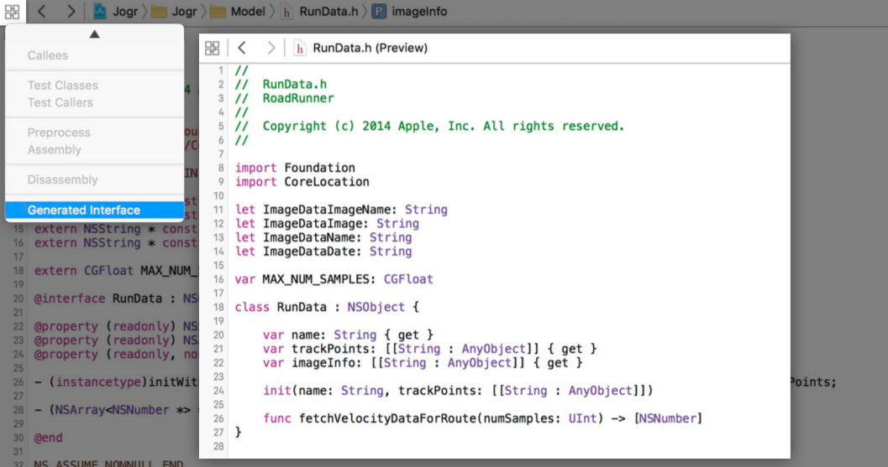

# Swift and Objective-C Interoperability

整理自 [WWDC 2015 Session 401 Swift and Objective-C Interoperability](https://developer.apple.com/videos/play/wwdc2015-401/) 的 PPT。。。

- [Swift 接口如何暴露给 Objective-C](#Working with Objective-C)
- [错误处理](#Error Handling)
- [为空性注释](#Nullability Annotations)
- [轻量泛型](#Lightweight Generics)
- [__kindof](#“Kindof”Types)

<a name="Working with Objective-C"></a>
## Swift 接口如何暴露给 Objective-C

Xcode 7 支持对 Objective-C 接口进行预览，查看其对应的 Swift 接口：
 




#### 一般来说，继承自 Objective-C 类的 Swift 类，其接口都会暴露给 Objective-C

```swift
class MyController : UIViewController {
	func refresh() {
		// 此方法会暴露给 Objective-C
	}
}
```

#### 被标记`private`修饰符则不会暴露给 Objective-C

```swift
class MyController : UIViewController {
	private func refresh() {
		// 此方法被标记 private，不会暴露给 Objective-C
	}
}
```

#### 使用 Swift 独有特性后不会暴露给 Objective-C

```swift
class MyController : UIViewController {
	// 此方法使用了 Swift 元组，Objective-C 无法实现元组，因此不会暴露给 Objective-C
	func refresh() -> (Int, String)? {
    	return nil
	}
}
```

#### `@IBOutlet`、`@IBAction`、`@NSManaged`、`dynamic`、`@objc`

被标记`private`修饰符后，可通过标记上述特性或修饰符暴露给 Objective-C。

其本质是因为`@objc`特性。继承自 Objective-C 类的 Swift 类，整个类会被自动添加`@objc`特性，而使用`private`修饰符后则不会自动添加`@objc`特性。

使用`@IBOutlet`、`@IBAction`、`@NSManaged`、`dynamic`特性都会隐式获得`@objc`特性。

#### 使用 Swift 独有特性后无法使用`@objc`特性

```swift
class MyController : UIViewController {
	// error: method cannot be marked @objc because its result type cannot be represented in Objective-C
    // 此方法使用了 Swift 元组，Objective-C 无法实现元组，因此不可以通过添加 @objc 特性暴露给 Objective-C
    @objc func refresh() -> (Int, String)? {
        return nil
    }
}
```

#### 非 Objective-C 类的 Swift 类，无法采纳 Objective-C 中的协议

```swift
class MyController : UIWebViewDelegate {
	// 报错：error: type 'MyController' does not conform to protocol 'NSObjectProtocol'
}
```

#### 选择器冲突

下面的方法会报错：`error: method 'performOperation' with Objective-C selector 'performOperation:' conflicts with previous declaration with the same Objective-C selector`：


```swift
class CalculatorController : UIViewController {

    func performOperation(op: (Double) -> Double) { }

    func performOperation(op: (Double, Double) -> Double) { }
}
```

这是因为暴露给 Objective-C 后，两个方法的选择器都是`performOperation:`，发生冲突。

而在 Swift，由于参数类型不同，这是两个不同的方法。

可以使用`@objc`特性的另一种用法为第二个方法起个 Objective-C 别名：

```swift
@objc(performBinaryOperation:)
func performOperation(op: (Double, Double) -> Double) { }
```

或者使用`@nonobjc`特性禁止此方法暴露给 Objective-C：

```swift
@nonobjc
func performOperation(op: (Double, Double) -> Double) { }
```

#### 函数指针

Objective-C 的函数指针类似下面这样：

```objective-c
typedef void (*dispatch_function_t)(void *);
```

在 Swift，它们变成了这样：

```swift
typealias dispatch_function_t = @convention(c) (UnsafeMutablePointer<Void>) -> Void
```

<a name="Error Handling"></a>
## 错误处理

在 Objective-C，会产生错误的方法类似这样：

```objective-c
- (id)contentsForType:(NSString *)typeName error:(NSError **)outError;
```

在 Swift，上述方法变成了这样：

```swift
func contentsForType(typeName: String) throws -> AnyObject
```

可以看到，`id`变为了`AnyObject`，而`error:(NSError **)outError`变为了`throws`关键字。

#### 返回类型

会产生错误的 Objective-C 方法的`BOOL`类型返回值会变为`Void`：

```objective-c
// Objective-C
- (BOOL)readFromURL:(NSURL *)url error:(NSError **)outError;
```

```swift
// Swift
func readFromURL(url: NSURL) throws -> Void
```

#### 方法名

会产生错误的 Objective-C 方法的方法名中的“AndReturnError”会被去除：

```objective-C
// Objective-C
- (BOOL)checkResourceIsReachableAndReturnError:(NSError **)error;
```

```swift
// Swift
func checkResourceIsReachable() throws -> Void
```

#### 回调

若会产生错误的 Objective-C 方法使用回调 block，则不会改变，依旧使用`NSError`对象：

```objective-c
// Objective-C
- (void)moveToURL:(NSURL *)url completionHandler:(void (^)(NSError *))handler;
```

```swift
// Swift
func moveToURL(url: NSURL, completionHandler handler: (NSError?) -> Void)
```

#### 定义错误

在 Swift，可通过采纳`ErrorType`协议的枚举来定义一种错误类型：

```swift
@objc enum RequestError: Int, ErrorType {
    case Incomplete = 9001
}
```

该枚举会像下面这样暴露给 Objective-C：

```objective-c
typedef SWIFT_ENUM(NSInteger, RequestError) {
    RequestErrorIncomplete = 9001,
};
static NSString * const RequestErrorDomain = @"MyApp.RequestError";
```

在 Swift，类似下面这样抛出错误：

```swift
func sendRequest(request: Request) throws {
    if !request.isComplete {
        throw RequestError.Incomplete
    }
}
```

#### 处理错误

在 Objective-C，像下面这样处理方法产生的错误：

```objective-c
NSError *error;

id result = [controller sendRequest:request error:&error];
if (!result) {
    NSLog(@"failure %@: %ld", error.domain, error.code);

    return nil;
}
// 打印输出 failure MyApp.RequestError: 9001
```

在 Swift，像下面这样处理方法产生的错误：

```swift
func preflight() -> Bool {
    do {
        try url.checkResourceIsReachable()
        resetState()
        return true
    } catch NSURLError.FileDoesNotExist { 
        return true // still okay
    } catch {
        return false
    }
}
```

<a name="Nullability Annotations"></a>
## 为空性注释

在 Objective-C，可以像这样为属性和方法添加为空性注释：

```objective-c
NS_ASSUME_NONNULL_BEGIN
@interface UIView
@property (nonatomic, readonly, nullable) UIView *superview; 
@property (nonatomic, readonly, copy) NSArray *subviews;
- (nullable UIView *)hitTest:(CGPoint)point withEvent:(nullable UIEvent *)event;
@end
NS_ASSUME_NONNULL_END
```

在 Swift，对应接口如下：

```swift
class UIView {
    var superview: UIView? { get }
    var subviews: [AnyObject] { get }
    func hitTest(point: CGPoint, withEvent event: UIEvent?) -> UIView?
}
```

如上所示，除非单独标注，否则`NS_ASSUME_NONNULL_BEGIN`和`NS_ASSUME_NONNULL_END`这对宏范围内的指针变量，都会作为非可选类型导入到 Swift。但有个例外，就是`NSError**`这种二级指针类型，每一级都会作为可选类型导入到 Swift。

`nullable`对应可选类型，`null_unspecified`对应隐式解包可选类型。

`nonnull`对应非可选类型，不过一般使用宏会更方便。

即使不转换到 Swift，只在 Objective-C 中使用时，也建议使用为空性注释，这可以让编译器进行额外的检查。例如，如果将`nil`传递给标注`nonnull`的方法参数或赋值给属性，编译器就会发出警告。

对于 C 指针，上述三种标识符需使用`_Nonnull`、`_Nullable`和`_Null_unspecified`这种形式，或者`__nonnull`、`__nullable`和`__null_unspecified`这种形式，并且需放在`*`后面：

```objective-c
CFArrayRef __nonnull CFArrayCreate(
    CFAllocatorRef __nullable allocator, 
    const void * __nonnull * __nullable values, 
    CFIndex numValues, 
    const CFArrayCallBacks * __nullable callBacks);
```

事实上，下划线开头的这种形式也可以用来修饰表示对象的指针，这种形式是通用的。

<a name="Lightweight Generics"></a>
## 轻量泛型

Xcode 7 从编译器层面增加了对 Objective-C 的“泛型”支持，这完全是编译器提供的辅助特性，不会对 Objective-C 运行时以及最终生成的代码造成任何影响。

#### 集合类型的元素类型

在 Objective-C，普通形式的数组像下面这样：

```objective-c
@interface UIView
@property (nonatomic, readonly, copy) NSArray *subviews;
@end
```

导入到 Swift 后，数组中的元素都是`AnyObject`类型，即对应 Objective-C 的`id`类型：

```swift
class UIView {
    var subviews: [AnyObject] { get }
}
```

而使用了轻量泛型后，数组中的类型就明确了：

```objective-c
// Objective-C
@interface UIView
@property (nonatomic, readonly, copy) NSArray<UIView *> *subviews;
@end
```

```swift
// Swift
class UIView {
    var subviews: [UIView] { get }
}
```

这有助于编译器进行类型检查：

```objective-c
NSURL *url = ...;
NSArray<NSURL *> *components = url.pathComponents;
// warning: incompatible pointer types initializing ‘NSArray<NSURL *> *’ with ‘NSArray<NSString *> *’
```

```objective-c
NSMutableArray<NSString *> *results = ...;
[results addObject:@17];
// warning: incompatible pointer types sending ‘NSNumber *’ to parameter of type ‘NSString *’
```

#### 泛型类

如下代码中，`<ObjectType>`指定了数组的泛型类型：

```objective-c
@interface NSArray<ObjectType> : NSObject
- (ObjectType)objectAtIndex:(NSUInteger)index;
- (instancetype)initWithObjects:(const ObjectType [])objects count:(NSUInteger)cnt;
- (NSArray<ObjectType> *)arrayByAddingObject:(ObjectType)anObject;
@end
```

如下代码中，`<KeyType, ObjectType>`指定了字典的泛型类型：

```objective-c
@interface NSDictionary<KeyType, ObjectType> (Lookup)
- (nullable ObjectType)objectForKey:(KeyType)aKey;
@end
```

还可以为泛型类型添加类型限制：

```objective-c
// 只接受 NSNumber * 类型的泛型
@interface NSArray<ObjectType: NSNumber *> : NSObject
@end
```

<a name="“Kindof”Types"></a>
## __kindof

未使用轻量泛型之前，下面的代码不会有任何问题：

```objective-c
@interface UIView
@property (nonatomic, readonly, copy) NSArray *subviews; 
@end

[view.subviews[0] setTitle:@“Yes” forState:UIControlStateNormal];
```

而如果使用了轻量泛型，将`NSArray *`变为`NSArray<UIView *> *`，编译器就会报出警告：

`warning: ‘UIView’ may not respond to ‘setTitle:forState:’`

可以使用`__kindof`修饰符来表明数组中元素是`UIView`或是其子类：

```objective-c
@interface UIView
@property (nonatomic, readonly, copy) NSArray<__kindof UIView *> *subviews; 
@end
```

从数组中取出元素后，就可以不用任何强制转换，直接调用子类方法，或者赋值给子类类型的指针：

```objective-c
[view.subviews[0] setTitle:@“Yes” forState:UIControlStateNormal];
UIButton *button = view.subviews[0];
```

不只是容器类，还可以使用`__kindof`修饰方法返回值之类的：

```objective-c
// 没有 __kindof 之前，将此方法的返回值赋给自定义的 UITableViewCell 子类时，总是会显示警告，必须进行强制转换
- (__kindof UITableViewCell *)dequeueReusableCellWithIdentifier:(NSString *)identifier
```