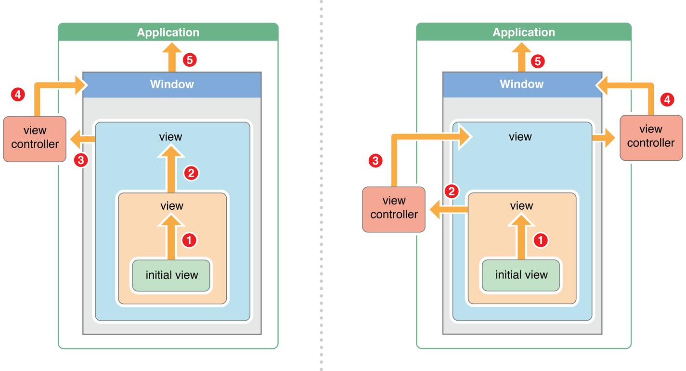

# 事件传递：响应者链条

翻译总结自 [*Event Handling Guide for iOS*](https://developer.apple.com/library/ios/documentation/EventHandling/Conceptual/EventHandlingiPhoneOS/Introduction/Introduction.html#//apple_ref/doc/uid/TP40009541-CH1-SW1) 之 [*Event Delivery: The Responder Chain*](https://developer.apple.com/library/ios/documentation/EventHandling/Conceptual/EventHandlingiPhoneOS/event_delivery_responder_chain/event_delivery_responder_chain.html#//apple_ref/doc/uid/TP40009541-CH4-SW2)。主要包含如下三部分内容：


- [通过 hit-testing 过程找出被触摸的视图](#Hit-Testing Returns the View Where a Touch Occurred)
<a name="Hit-Testing Returns the View Where a Touch Occurred"></a>
- [由响应者对象组成的响应者链条](#The Responder Chain Is Made Up of Responder Objects)
- [事件在响应者链条上的传递路径](#The Responder Chain Follows a Specific Delivery Path)

当用户触发一个事件时，例如触摸事件、晃动事件或者远程控制事件，`UIKit` 就会将事件的各种信息包装在 `UIEvent` 对象里，并放入应用程序的事件队列中。封装了事件信息的 `UIEvent` 对象会沿着特定的路线传递，直到某个对象着手处理它。最初，`UIApplication` 单例对象会从事件队列中接收 `UIEvent` 对象并开始进行传递。通常，它会将事件传递给主窗口，主窗口会进一步将事件传递给某个能处理该事件的对象，这取决于事件的类型。

- 触摸事件

    对于触摸事件，主窗口对象会试图将该事件传递给被触摸的视图。被触摸的视图被称为 `hit-test` 视图，查找该视图的过程被称为 `hit-testing`，详情参阅【[通过 Hit-Testing 找出被触摸的视图](#Hit-Testing Returns the View Where a Touch Occurred)】。

- 运动事件与远程控制事件
	
    主窗口会将这类事件传递给第一响应者来处理，详情参阅【[由响应者对象组成的响应者链条](#The Responder Chain Is Made Up of Responder Objects)】。

事件传递的最终目的是找出一个能处理并响应事件的对象。`UIKit` 会将事件传递给最适合处理该事件的对象，对于触摸事件，该对象往往是被触摸的视图；对于其他事件，该对象往往是第一响应者。


## 通过 hit-testing 过程找出被触摸的视图

`iOS` 通过 `hit-testing` 过程来找出被触摸的视图。该过程会检查触摸点是否位于相关视图的范围之内。如果触摸点位于视图范围内，则进一步对其子视图执行检查过程，最终，触摸点所在的视图层级最底层的视图（对于界面来说是最上层的视图）将成为 `hit-test` 视图，`iOS` 会将触摸事件传递给该视图进行处理。

例如，假如用户触摸了下图中的 `View E`，那么 `iOS` 将按照如下过程来找出 `hit-test` 视图：

1. 判断触摸点是否位于 `View A` 内，若是则进一步检查子视图 `View B` 和 `View C`。
2. 由于触摸点不在 `View B` 内，而在 `View C` 内，因此进一步检查子视图 `View D` 和 `View E`。
3. 由于触摸点不在 `View D` 内，而在 `View E` 内，并且 `View E` 是视图层级最底层的视图，因此它就是 `hit-test` 视图。


上述查找过程主要利用 `hitTest(_:withEvent:)` 方法，该方法会根据给定的 `CGPoint` 和 `UIEvent` 返回 `hit-test` 视图。首先，该方法会向接收者发送 `pointInside(_:withEvent:)` 消息，如果传入的 `CGPoint`（即触摸点）位于接收者（也就是某个视图）的范围内，`pointInside(_:withEvent:)` 将会返回 `true`。然后，按照子视图添加顺序的相反顺序，对每个子视图发送 `hitTest(_:withEvent:)` 消息，进一步检查子视图。如果触摸点不在视图范围内，`pointInside(_:withEvent:)` 会返回 `false`，`hitTest(_:withEvent:)` 就会直接返回 `nil`，不会进一步检查子视图。如上递归过程结束后，最初调用的 `hitTest(_:withEvent:)` 方法将会返回 `hit-test` 视图，或者返回 `nil`，那么该触摸事件将不会被任何视图处理。如上所述的递归判断过程类似下面这样：

```swift
class UIView: UIResponder {
    func hitTest(point: CGPoint, withEvent event: UIEvent?) -> UIView? {
        // 先调用 pointInside(_:withEvent:) 方法判断触摸点是否在自身范围内
        if pointInside(point, withEvent: event) {
            // 触摸点在自身范围内，反向遍历子视图，即后添加到视图层级上的子视图（在界面相对靠上的子视图）会被优先遍历到
            for subview in subviews.reverse() {
                // 将触摸点由自身坐标系转换到子视图坐标系内
                let pointInSubview = subview.convertPoint(point, fromView: self)
                // 调用子视图的 hitTest(_:withEvent:) 方法对子视图进行检查
                if let hitTestView = subview.hitTest(pointInSubview, withEvent: event) {
                    return hitTestView // 返回了非 nil 值，该视图即是 hit-test 视图
                }
            }
            return self // 所有子视图都返回了 nil，那么视图自己就是 hit-test 视图
        }
        return nil // 触摸点不在自身范围内，直接返回 nil
    }
    
    func pointInside(point: CGPoint, withEvent event: UIEvent?) -> Bool {
        return bounds.contains(point) // 判断触摸点是否在自身范围内
    }
}
```

这里需要注意一点，如果某个子视图的一部分位于父视图范围之外，在父视图的 `clipsToBounds` 属性关闭的情况下，超出父视图范围的这部分子视图不会被裁剪掉，但是此时触摸该子视图位于父视图之外的部分将没有任何反应。因为按照上面所述的判断过程，判断到父视图时，由于触摸点根本不在父视图范围内，也就不会进一步去判断子视图了。

`hit-test` 视图拥有最先处理触摸事件的机会，之后，还可以选择将触摸事件沿响应者链条传递给下一个响应者，例如 `hit-test` 视图的父视图。默认情况下，触摸事件被处理后不会传递给下一个响应者。详情参阅【[由响应者对象组成的响应者链条](#The Responder Chain Is Made Up of Responder Objects)】。

<a name="The Responder Chain Is Made Up of Responder Objects"></a>
## 由响应者对象组成的响应者链条

很多类型的事件都依赖于响应者链条进行传递。顾名思义，响应者链条即是一系列响应者对象链接在一起，开始于第一响应者对象，结束于 `UIApplication` 单例对象（实际上往往结束于它的代理对象）。如果第一响应者无法处理事件，事件就会沿响应者链条往下传递，即传递给下一个响应者。

所谓的响应者对象，即是 `UIResponder` 类及其子类的对象，它们具有响应和处理事件的能力。`UIApplication`、 `UIViewController` 以及 `UIView` 都是 `UIResponder` 的子类，这意味着所有视图和视图控制器都是响应者对象。注意， `CALayer` 直接继承自 `NSObejct`，因此它不是响应者对象。

第一响应者即是第一个有机会处理事件的响应者对象。通常情况下，它是一个视图。一个响应者对象若想成为第一响应者，需满足如下两点：

1. 重写 `canBecomeFirstResponder()` 方法并返回 `true`。`UIResponder` 的默认实现是返回 `false`。
2. 收到 `becomeFirstResponder()` 消息。在某些情况下，往往会手动给响应者发送此消息，从而主动成为第一响应者。

除了传递事件，响应者链条还会传递一些别的东西，具体说来，响应者链条可传递如下事件或者消息：

- 触摸事件
	
	要处理触摸事件，响应者可以重写 `touchesBegan(_withEvent:)` 系列方法。  
	如果 `hit-test` 对象不处理触摸事件，`UIResponder` 的默认实现会将触摸事件沿着响应者链条传递给下一响应者。

- 运动事件

	要处理运动事件，响应者需要重写 `motionBegan(_:withEvent:)` 系列方法。  
	如果第一响应者不处理事件，`UIView` 的默认实现会将运动事件沿着响应者链条传递给下一响应者。  
	
- 远程控制事件

	要处理远程控制事件，响应者需要实现 `remoteControlReceivedWithEvent(_:)` 方法。  
	在 `iOS 7.1` 之后，最好使用 `MPRemoteCommandCenter` 获取多媒体控制操作对应的 `MPRemoteCommand` 对象，并注册相应的回调方法或者 `block`。
	
- 动作消息

	当用户操作某个控件后，例如按钮或者开关，如果该控件的 `target` 为 `nil`，那么控件绑定的方法将会从控件开始，沿着响应者链向下传递，寻找一个实现了相应方法的响应者。
	
- 编辑菜单消息

	当用户点击了编辑菜单的某个命令后，`iOS` 通过响应者链条来寻找一个实现了相应方法（例如 `cut(_:)`， `copy(_:)`，`paste(:_)`）的响应者。
	
- 文本编辑

	当用户点击了 `UITextField` 或者 `UITextView` 后，该控件会自动成为第一响应者，弹出虚拟键盘并成为输入焦点。

当用户点击 `UITextField` 或者 `UITextView` 后，它们会自动成为第一响应者，而其他响应者则需通过接收 `becomeFirstResponder()` 消息来成为第一响应者。

<a name="The Responder Chain Follows a Specific Delivery Path"></a>
## 事件在响应者链条上的传递路径

如果某个应该处理事件的响应者（无论是 `hit-test` 视图还是第一响应者）不处理事件，`UIKit` 就会将事件沿着响应者链条向下传递，直到找到处理事件的响应者，或者再没有下一个响应者。每个响应者都可以决定是否处理传给自己的事件，以及是否将事件传递给下一个响应者，即 `nextResponder` 属性所引用的响应者。

如下两图展示了两种响应者链条的传递路径：



如左图所示，事件按如下路径进行传递：

1. 绿色的 `initial view` 优先处理事件，如果不处理事件，就将事件传递给父视图，因为它并非视图控制器所属的视图。
2. 黄色的视图有机会处理事件，如果不处理事件，它也将事件传递给父视图，因为它也不是视图控制器所属的视图。
3. 蓝色的视图有机会处理事件，如果不处理事件，因为它是视图控制器所属的视图，它会将事件传递给视图控制器，而非自己的父视图。
4. 视图控制器有机会处理事件，如果不处理事件，它将事件传递给自己的视图的父视图，在这种情况下即是主窗口。
5. 主窗口有机会处理事件，如果不处理事件，它将事件传递给 `UIApplication` 单例对象。
6. `UIApplication` 单例对象有机会处理事件，如果不处理事件，并且应用代理也是 `UIResponder` 子类，它会将事件传递给应用代理。
7. 如果到最后也没有响应者处理事件，事件就会被丢弃。

对于右图所示，事件传递过程大同小异，只不过靠左的视图控制器的视图的父视图不是主窗口而是另一个视图控制器的视图，因此它将事件传递给靠右的视图控制器的视图。

如上所述，事件传递的规律是，一个视图将事件传递给父视图，如果自己是视图控制器的视图，则先传给视图控制器，再传递给父视图。主窗口将事件传给 `UIApplication` 单例对象，后者再进一步传递给 `UIApplicationDelegate`，前提是应用代理是 `UIResponder` 的子类。

> 注意  
前面反复提到“不处理事件”这个说法，指的是响应者没有对 `UIResponder` 的相应事件传递方法进行自定义重写。例如，对于触摸事件，是通过 `touchesBegan(_:withEvent:)` 等系列方法进行传递的。这些方法的默认实现即是将事件传递给下一响应者，当响应者未重写这些方法时，事件就会传递到下一响应者。即使响应者重写了这些方法，也就是处理了事件，依然可以选择将事件继续传递给下一响应者，此时最好调用超类的相同方法，而不是通过 `nextResponder` 拿到下一响应者来手动调用其相关方法。
