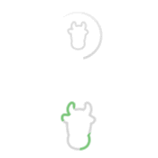
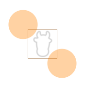
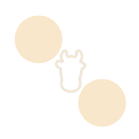

## 利用 mask 实现注水动画



主角是下面这个绿色的注水动画。

思路来自此篇博客 [使用CALayer的mask动画](http://wuwen1030.github.io/blog/2014/11/17/shi-yong-calayerde-maskdong-hua/)。

最开始是在 CocoaChina 上看到的，感觉没有配图不好理解，于是自己结合配图总结了一下，最后才发现作者原文里给了配图。 -_-#

## mask 属性介绍

`CALayer`有个`mask`属性：

```swift
var mask: CALayer?
```

为一个图层设置了`mask`，可以理解为将作为`mask`的图层遮盖在该图层上。然而，`mask`图层是不可见的，无论`mask`图层的背景色是否透明，其本身都是“透明”的。而且，对于被遮盖的图层 ，只有被`mask`图层背景色不透明或者半透明的部分所遮盖的部分，才是可见的；而被背景色完全透明部分所遮盖的部分，也将是透明的。另外，`mask`图层所在的坐标系是被遮盖图层的本地坐标系，也就是说，要让`mask`图层和被遮盖图层完全重合，需将`mask`图层的`frame`设置为被遮盖图层的`bounds`。

## 注水动画实现思路

如下图所示，这里使用了两个重叠的`UIImageView`来呈现图片，这种图片除了图案部分都是透明的：


一般情况下，下层的灰色图片会被上层的绿色图片遮挡住，可以为上层`UIImageView`的图层设置`mask`而让其透明或者部分透明。

如下代码为上层绿色图片的`UIImageView`设置了完全重合的`mask`，由于`CALayer`的`backgroundColor`默认为`nil`，也就是说图层默认是完全透明的，正如前面对`mask`的介绍，此时`greenImageView`会因为完全透明的`mask`而完全透明。

```swift
let mask = CALayer()
mask.frame = greenImageView.bounds
greenImageView.layer.mask = mask
```

接下来，为`mask`图层添加两个子图层，这两个子图层是`path`为圆形的`CAShapeLayer`，其尺寸和`greenImageView`相同。

```swift
let bounds = greenImageView.bounds

let upperLeftLayer = CAShapeLayer()
upperLeftLayer.bounds = bounds
upperLeftLayer.position = CGPoint(x: -10, y: -10)
upperLeftLayer.path = UIBezierPath(ovalInRect: bounds).CGPath
mask.addSublayer(upperLeftLayer)

let bottomRightLayer = CAShapeLayer()
bottomRightLayer.bounds = bounds
bottomRightLayer.position = CGPoint(x: bounds.maxX + 10, y: bounds.maxY + 10)
bottomRightLayer.path = UIBezierPath(ovalInRect: bounds).CGPath
mask.addSublayer(bottomRightLayer)
```

它们之间的位置关系类似下图所示：



注意，此图仅仅是为了演示位置关系，并非上述代码的效果。此时的真实效果是绿色图案透明不可见，只能看见灰色图案，而且看不见两个圆形和中间的方块。

中间的方块是`greenImageView`以及`mask`图层所处的位置，它们是完全重合的。两个圆形则是`mask`图层的两个子图层的位置，由于调整了`position`，它们超出了父图层的范围。

`CAShapeLayer`的`fillColor`默认是不透明的黑色，此时对于`mask`图层来说，不透明的部分就是两个圆形和正方形相交的部分。

因此，此时`greenImageView`的绿色图案部分正好被`mask`图层的透明部分遮挡，依旧是透明的，只能看到下层的灰色图片。

如果此时对两个圆形的子图层做动画，使其向中心靠拢，如下所示：



圆形区域的移动代表不透明区域的移动，因此被圆形区域遮盖的那部分绿色图案将不再透明，从而挡住下层的灰色图案，形成如下效果：


## 环形指示器动画实现思路

这个就非常简单了，依靠图片即可实现，并未用到`mask`。`SVProgressHUD`则是使用图片配合`mask`实现的。


依旧是两个重叠的`UIImageView`，上层是个环形的图片，两个图片除了图案部分都是透明的。

然后，对上层的`UIImageView`的图层做无限旋转动画就行了。

```swift
let animation = CABasicAnimation(keyPath: "transform.rotation.z")
animation.byValue = 2 * M_PI
animation.duration = 1
animation.repeatCount = Float.infinity
ringImageView.layer.addAnimation(animation, forKey: nil)
```


